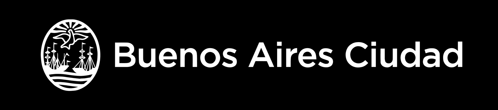

    <a href="https://matipretz.github.io/fullstackoeste"><h1>Grupo 9 Noticias - TPO - CaC 4.0 Q1 2024 - Com 24134</h1></a>
    
      

## Menú

A. [Título y Descripción del Proyecto](#título-y-descripción-del-proyecto)

B. [Público Objetivo](#público-objetivo)

C. [Estructura del Sitio](#estructura-del-sitio)

D. [Diseño y Estilo](#diseño-y-estilo)

E. [Responsividad](#responsividad)

F. [Integrantes del Equipo](#integrantes-del-equipo)

G. [Recursos Utilizados](#recursos-utilizados)

H. [Links](#links)

## Título y Descripción del Proyecto:

- Título: "Grupo 9 Noticias"
- Descripción: Creación de un portal web con el objetivo de ofrecer ...

## Público Objetivo:

- Publico general

## Estructura del Sitio:

- Home: Layout con las noticas mas relevantes
- Noticias: Vista del pool de noticias ordenadas cronologicamente
- Nosotros: Integrantes y breve descripción de los valores y la visión del grupo.
- Contacto: Proporciona un formulario para enviar mensajes.

## Diseño y Estilo:

- Estilo visual: Relajado y moderno.
- Colores: Nuestra paleta se basa en colores claros acompañados de elementos blancos, para transmitir frescura y amabilidad. Adoptamos un tema alternativo oscuro con una combinación predominante de negro y grises, equilibrado con elementos llamativos y tonos claros.
- Tipografía: Fuente estilizada en titulares y cabeceras, Sans-serif para una legibilidad óptima en textos de cuerpo.

## Responsividad:

- Se estudiaron metodos modernos con la simplicidad como requisito fundamental. Se utilizan unidades relativas y propiedades avanzadas de CSS.
- Las fuentes son reescaladas dinamicamente en proporcion al width del viewport por medio de la propiedad de calculo que ofrece CSS.
- Las secciones con grids se escalan y disponen automaticamente gracias a grid-template y la propiedad minmax
- Se utilizó mediaquerys para 3 tamaños de pantalla para cumplir con los requerimientos en el detalle de una nota como ejemplo (nota1.html)

### Formulario de contacto:

- Integra un servicio controlador de correo que remite el formulario sin exponer la casilla. Verifica que los campos no esten vacios y se vale de Regex para corroborar el formato del email.

## Integrantes del Equipo:

- [Lucas Ojunian](https://www.linkedin.com/in/lucas-ojunian-012a5583/)
- [Juan Marcos Kruppa](https://www.linkedin.com/in/kruppamarcos/)
- [Matias Martin Murad Pretz](https://www.linkedin.com/in/matipretz/)
- [Noelia Matamoros](https://www.linkedin.com/in/noelia-matamoros-1ba9591b9/)

## Recursos Utilizados:

- [Favicon](https://favicon.io/): Generador de favicon.
- [FontAwesome](https://fontawesome.com/): Resuelve los iconos utilizados en el footer.
- [Google Fonts](https://fonts.google.com/): Importamos las familias Orbitron y Noto Sans Display.
- [MetaTags.io](https://metatags.io/): Genera meta-tags de forma automatica.
- [Squoosh](https://squoosh.app/): Compresor de imagenes.
- [Tailwind CSS](https://tailwindcss.com/): Framework CSS.
- [UnStatic](https://forms.un-static.com/): Controlador formulario/e-mail.

## Links:

- [Contacto](mailto:mati.pretz+dev@googlemail.com?subject=[G9N])
- [Repositorio](https://github.com/matipretz/grupo9noticias)
- [Sitio](https://grupo9.vercel.app/)

### [Subir](#menú)
